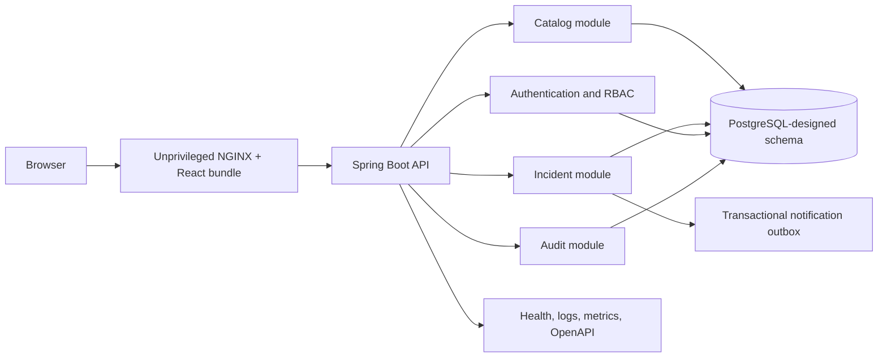

# ServicePulse Architecture

Status: Implemented local architecture; external deployment pending
Last updated: 2026-07-14

## Context

ServicePulse is an independent portfolio project for fictional development
teams. It is a modular monolith: one deployable backend with feature boundaries
and one PostgreSQL-designed database schema.

Current evidence boundary:

- Backend: 68 local tests passed in the recorded clean regression.
- Frontend: 14 local tests passed in the recorded frontend gate.
- Accessibility: automated axe coverage spans eight current route states.
- OpenAPI: 19 implemented paths were inspected locally with bearer/public
  security boundaries.
- Runtime: real-browser workflow evidence used the H2 development substitute.
- Not yet evidenced: Docker image execution, Compose health, PostgreSQL
  Testcontainers, remote GitHub Actions, public repository links, screenshots,
  demo media, and external deployment.



## Backend module boundaries

```text
dev.tirthrajsinh.servicepulse
|-- common          API errors and shared technical primitives
|-- configuration   security and framework configuration
|-- identity        users, authentication, and refresh tokens
|-- workspace       membership authorization and administration
|-- catalog         managed-service administration and lifecycle
|-- incident        aggregate, workflow, assignments, comments, timeline, persistence, and API
|-- audit           material-change audit records
|-- dashboard       workspace-scoped aggregate read model
`-- system          operational status
```

Modules use IDs instead of bidirectional JPA graphs across boundaries. This limits accidental coupling and makes authorization checks explicit.

## Data design

- UUID application-generated identifiers.
- UTC timestamps stored as `timestamp with time zone`.
- Database check constraints for enum-like state.
- Foreign keys for tenant and service ownership.
- Optimistic locking on incidents.
- Unique workspace/user membership and service slug constraints.
- Incident declaration, transition, assignment, and comment operations write their state/event/audit records in one transaction.
- Incident declaration and status transition also enqueue notification jobs in that transaction.
- Exhausted notification jobs retain a failure timestamp and sanitized error class.
- Event and audit repositories expose writes/reads required by the application but no delete operation. Database-level immutability controls remain a later migration.

## Security model

Current foundation:

- No Spring-generated default user.
- Health, status, and OpenAPI routes are public.
- Registration, login, refresh, health, status, and OpenAPI routes are public.
- Every other route requires a signed access token.
- User credentials are verified against BCrypt hashes in PostgreSQL.
- Self-registration creates an enabled user account but grants no workspace
  membership automatically.
- A local in-memory limiter throttles repeated failed login attempts by
  normalized email address.
- Cross-origin browser access requires an explicit HTTPS or local development
  origin allowlist; the default allowlist is empty.
- Access tokens are short-lived HMAC-signed JWTs containing identity, not workspace roles.
- Refresh tokens are opaque random values; SHA-256 hashes are stored and rotated.
- Incident declaration, status transition, assignment, and comment creation require an enabled administrator or responder membership in the target workspace.
- Incident, timeline, and comment retrieval require an enabled administrator, responder, or viewer membership in the incident workspace.
- Assignments accept only enabled administrators/responders from the incident workspace.
- Search and dashboard queries require an enabled current membership before applying a workspace predicate.
- Managed-service reads require membership; creation and updates require the current administrator role.
- Membership mutations lock workspace rows in deterministic user-ID order and preserve at least one enabled administrator.
- CSRF is disabled because the API accepts bearer tokens rather than browser cookies.

Planned:

- Distributed/shared-store login throttling, edge rate limits, login/refresh
  audit events, and invitation workflows.

## Testing boundaries

- Pure unit tests cover incident workflow invariants.
- H2 in PostgreSQL compatibility mode supports fast context/API tests, including transaction rollback, timeline ordering, audit writes, and membership boundaries.
- Testcontainers is the source of truth for PostgreSQL migration and integration behavior.
- Vitest covers authenticated role-separated flows, the HTTP token boundary,
  and automated axe scans across all current route families.
- A local real-browser pass covers the primary incident workflow and responsive
  layout against the Spring API with the labeled H2 development substitute.

H2 results must never be represented as PostgreSQL integration evidence.

## Database-side query model

Incident filtering uses a JPA specification whose first predicate is the workspace boundary. Free-text wildcard characters are escaped and pages use a stable `declaredAt DESC, id DESC` order. Dashboard cards use aggregate SQL rather than reading incident pages into application memory.

## Catalog model

Service slugs are immutable, workspace-unique identifiers. Administrators may update the display name, optional description, and lifecycle (`ACTIVE`, `MAINTENANCE`, or `RETIRED`). PUT updates are idempotent and only real changes write audit entries. Deletion is omitted while incident history references a service.

## Notification outbox

The request transaction inserts a `PENDING` outbox row after the incident row is flushed. A scheduled worker claims due/stale rows with a row lock, increments attempts, commits the `PROCESSING` claim, then invokes an adapter outside that transaction. Success becomes `DELIVERED`; failures return to `PENDING` with capped exponential backoff or become `FAILED` at the configured limit.

The stable job UUID is the downstream idempotency key. The system is intentionally at-least-once because a process can stop after adapter success and before acknowledgement. The local adapter emits a structured log and does not represent a tested external integration.

Failed jobs are queried through an administrator-only, workspace-scoped,
bounded page ordered by `failed_at DESC, id DESC`. A composite
workspace/status/failure-time index supports that access path. The read model
omits payload-like incident fields and exposes only the sanitized exception
class.

Failed-job replay is also administrator-only and workspace-scoped. It locks the
target row, accepts only `FAILED` jobs, clears failure fields, resets
`attempt_count` to zero, sets `next_attempt_at` to the operator request time,
and writes a `NOTIFICATION_JOB_REPLAYED` audit entry in the same transaction.
The original job UUID is preserved as the downstream idempotency key. Replay
does not call the adapter directly; the scheduled worker performs the retry so
delivery behavior stays on the same outbox path.

## Operations

- Actuator health.
- Prometheus metrics endpoint, protected by the default authenticated boundary.
- Native Logstash-format JSON console logs.
- Highest-precedence request correlation for public, authenticated, and rejected requests.
- Generated OpenAPI 3.1 metadata with a global HTTP bearer/JWT requirement and
  explicit public-operation overrides for login, refresh, and status.
- Compose provides a local PostgreSQL service.
- Compose defines PostgreSQL, the non-root Spring API, and an unprivileged
  static web/proxy tier with health-ordered startup.
- The web tier proxies only API and health paths, preserving a same-origin
  browser boundary while retaining SPA route fallback.
- Static responses include a restrictive CSP and related baseline headers;
  HSTS remains a future TLS-edge responsibility.
- Maven archive timestamps are fixed for byte-reproducible JAR packaging.
- Deployment target and rollback procedure remain undecided.
- The current workstation has no Docker execution evidence; Compose and image
  contracts are configuration evidence until run and recorded.

## Browser client

The client is a React single-page application with a typed API boundary. Access
tokens remain in memory; the opaque refresh token and selected workspace use
tab-scoped `sessionStorage`. A single automatic refresh is attempted after an
authenticated 401, and the failed request is retried once with a new bearer
token. Problem details are mapped into visible form/global errors.

The frontend asks the API for the current user's workspaces and roles. It does
not infer authorization from static configuration: controls are hidden for
viewers, while the server remains the enforcement boundary. Vite provides a
same-origin development proxy. Cross-origin hosting is available only when the
API is configured with an exact-origin allowlist; a public separate-origin
deployment still needs a fresh token-transport and CSP review.

## Trade-offs

### Modular monolith over microservices

One deployable reduces network, orchestration, tracing, and consistency overhead while preserving feature boundaries. A junior portfolio gains more from complete authorization, testing, and operations than from shallow service proliferation.

### JPA with explicit IDs across modules

JPA speeds transactional development. Avoiding cross-module object graphs keeps boundaries reviewable and reduces accidental data loading.

### H2 for fast tests plus PostgreSQL Testcontainers

H2 makes local tests possible without Docker. It cannot prove PostgreSQL behavior, so the real-database suite remains separate and mandatory before release.
